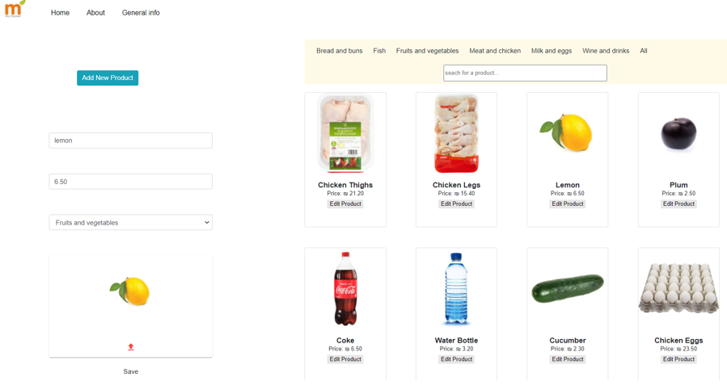
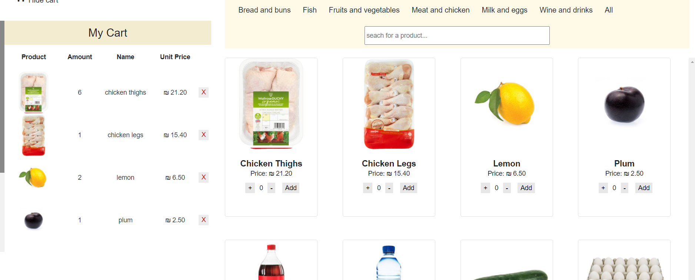
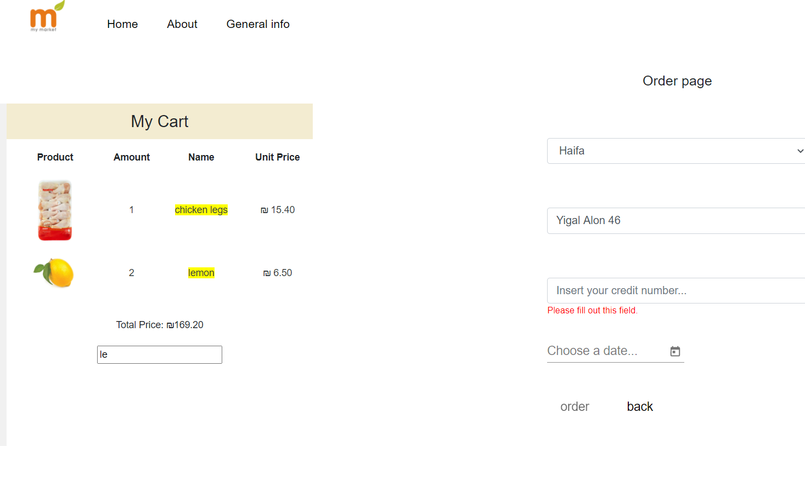
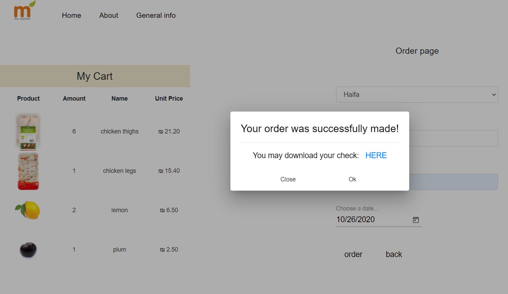
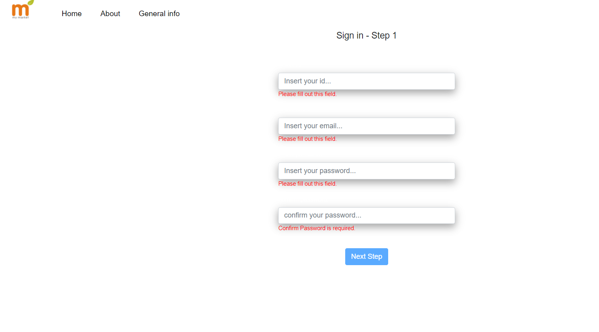
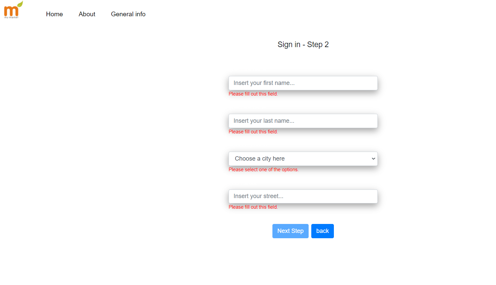

# Online_Store

Online Store SPA for selling groceries using Angular & Node.JS.

### Admin Panel:
* You can edit a product or add a new one.

### Shoppping cart and Products:
* The cart can be shown or hidden

***

### Order Page:
* Note that just for demonstration - only 3 orders are allowed per day.

***

### Order Successfully Completed:

***

### Receipt:
* The customer recieves a receipt as a text file.

***

### Register Step One:

***

### Register Step Two:

***
# use
app uses sql database with angular cli
run npm install
ng serve
# TestYourApp
# TestYourApp
# TestYourApp
